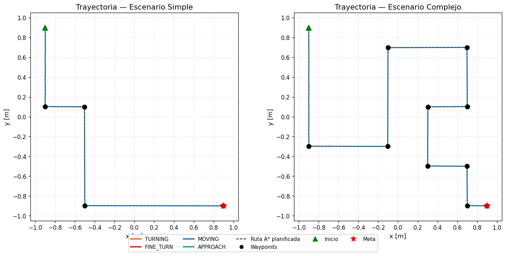
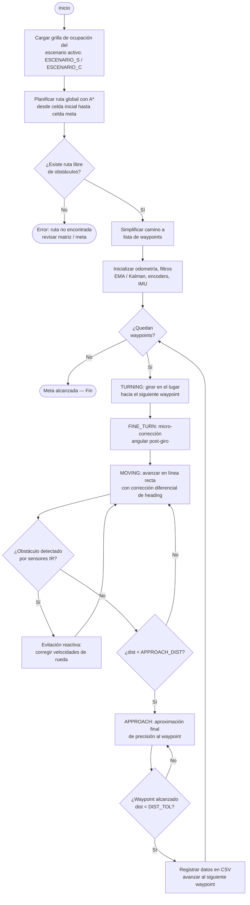
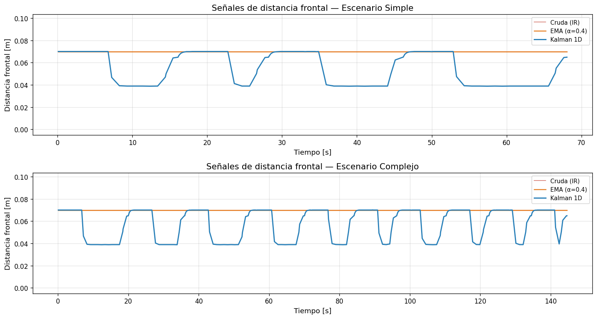
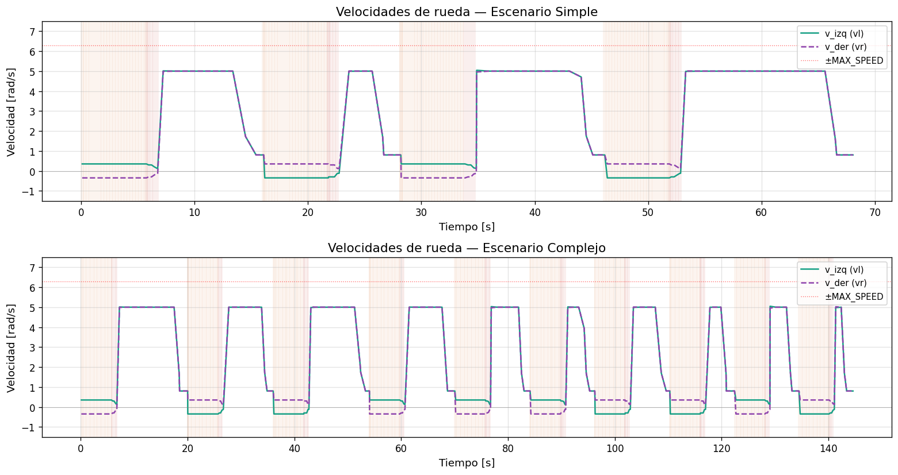
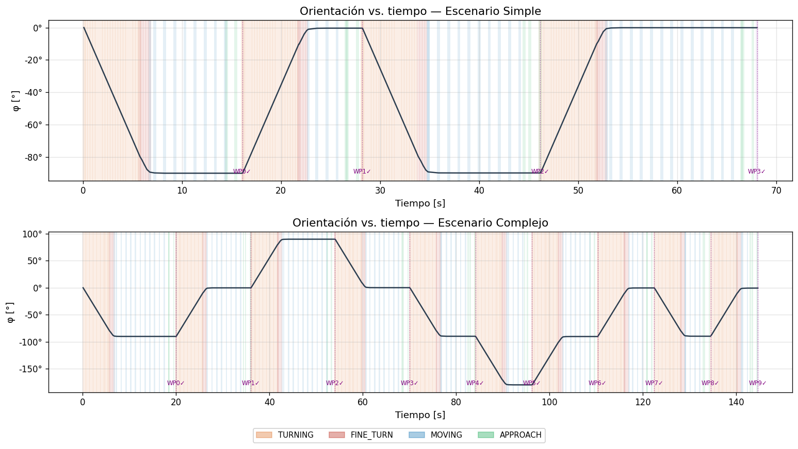
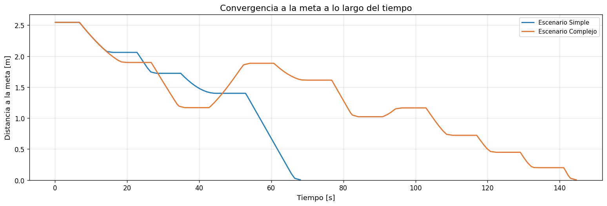
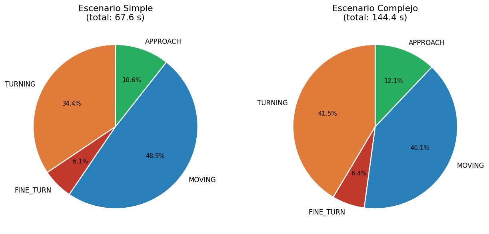

# Proyecto Final — Navegación Autónoma con Planificación de Rutas (A*)
### Robótica y Sistemas Autónomos 2026-01 — ICI 4150

**Integrantes:**
- Gabriel Reyes — Control, Fusión Sensorial y Navegación Local
- Benjamín Soto — Algoritmo y Lógica Global (Planificación de Rutas)
- Diego Zúñiga — Diseño de Entornos, Datos y Documentación

**Línea de desarrollo seleccionada:** Línea A — Planificación de rutas (A\* sobre grilla de ocupación), complementada con evitación reactiva de obstáculos.

---

## Tabla de Contenidos

1. [Descripción y Objetivo](#descripción-y-objetivo)
2. [Roles del Equipo](#roles-del-equipo)
3. [Materiales, Herramientas y Escenarios](#materiales-herramientas-y-escenarios)
4. [Configuración Temporal y Muestreo](#configuración-temporal-y-muestreo)
5. [Relación Explícita con Laboratorios 1 y 2](#relación-explícita-con-laboratorios-1-y-2)
6. [Explicación del Algoritmo y Diagrama de Flujo](#explicación-del-algoritmo-y-diagrama-de-flujo)
7. [Análisis de Señales y Resultados Obtenidos](#análisis-de-señales-y-resultados-obtenidos)
8. [Conclusiones, Limitaciones y Mejoras](#conclusiones-limitaciones-y-mejoras)
9. [Instrucciones para Ejecutar la Simulación](#instrucciones-para-ejecutar-la-simulación)

---

## Descripción y Objetivo

Este proyecto final consiste en diseñar, implementar y evaluar en Webots un sistema de
navegación autónoma para el robot móvil diferencial e-puck. A diferencia de los
laboratorios anteriores, el sistema evoluciona hacia una **meta global**: integra control
cinemático, percepción sensorial local, estimación de postura mediante odometría, y toma
de decisiones basada en un **algoritmo de planificación de rutas (A\*)** sobre un mapa
discreto (grilla de ocupación).

El objetivo es que el robot alcance una coordenada final de forma autónoma, siguiendo un
conjunto de waypoints **calculados algorítmicamente** —no definidos a mano— a partir de
la grilla de ocupación de cada escenario, conservando además la capacidad de evadir
obstáculos de última hora mediante reactividad basada en sensores IR.

Siguiendo los requisitos mínimos de la Línea A de la pauta, el sistema:

- Representa el entorno como una **grilla de ocupación (matriz 2D)**.
- Implementa **A\*** para planificar la ruta entre el punto inicial y la meta.
- Convierte la ruta planificada en **puntos intermedios (waypoints)** consumidos por el
  controlador de navegación local.
- Usa sensores IR para **corregir la trayectoria o evitar colisiones** ante obstáculos no
  contemplados en el mapa.
- Registra datos de ejecución para el análisis experimental posterior.

## Roles del Equipo

| Integrante | Rol | Tareas específicas |
|---|---|---|
| **Gabriel Reyes** | Control, Fusión Sensorial y Navegación Local | Modelo cinemático diferencial y odometría (Ec. 1–7); filtrado EMA/Kalman 1D; controlador de seguimiento de puntos; evitación reactiva de obstáculos. |
| **Benjamín Soto** | Algoritmo y Lógica Global | Diseño de la grilla de ocupación (traducción de coordenadas continuas de Webots a matriz discreta); implementación de A\*; generación de la ruta óptima inicio→meta. |
| **Diego Zúñiga** | Diseño de Entornos, Datos y Documentación | Diseño de los escenarios simple y complejo en Webots; sistema de registro de datos (CSV); generación de gráficos y análisis estadístico; estructuración del repositorio y redacción del README. |

Esta división de roles cubre de manera cruzada los criterios de la rúbrica: *Integración de
Laboratorios 1 y 2* y *Control de movimiento* (Gabriel) — *Implementación del algoritmo
principal* (Benjamín) — *Configuración del entorno*, *Evaluación experimental* y
*Repositorio/README* (Diego).

## Materiales, Herramientas y Escenarios

- **Simulador:** Webots R2025a.
- **Lenguaje:** Python 3.x.
- **Robot:** e-puck. Radio de rueda calibrado $r = 0.0205\text{ m}$; distancia entre ruedas
  $L = 0.05910\text{ m}$ (calibrado empíricamente en Webots a partir del valor nominal de
  fábrica de $0.052\text{ m}$, para compensar el deslizamiento real del modelo en
  simulación).
- **Sensores:**
  - Encoders de posición en ambas ruedas (`left wheel sensor`, `right wheel sensor`).
  - Anillo de 8 sensores infrarrojos de proximidad (`ps0` a `ps7`).
  - Unidad inercial (`inertial unit`) — usada como referencia de *heading* absoluto,
    inmune al deslizamiento de ruedas que sesga el ángulo calculado por odometría pura
    durante los giros en el lugar.
- **Actuadores:** Motores diferenciales de las ruedas izquierda y derecha
  (`left wheel motor`, `right wheel motor`), velocidad máxima $\pm 6.28\text{ rad/s}$.

### Escenarios de Prueba

Ambos escenarios comparten la misma arena cuadrada de $2 \times 2\text{ m}$
(`RectangleArena`, `floorSize 2 2`) y el mismo punto de partida del robot, en la esquina
superior izquierda del arena: `translation -0.9 0.9 0`.

**Escenario Simple (`escenario_simple.wbt`):** seis obstáculos pequeños (cajas de
$0.2 \times 0.2\text{ m}$) distribuidos sin formar pasillos cerrados, dejando amplio espacio
libre y una ruta relativamente directa entre el inicio y la meta. Sirve como caso base de
baja complejidad para validar el seguimiento de ruta sin presión de espacio.

**Escenario Complejo (`escenario_complejo.wbt`):** ocho paredes de distintas
dimensiones (entre $0.2\times0.2$ y $0.2\times1.6\text{ m}$) que forman pasillos angostos,
curvas obligadas y al menos un tramo en "zigzag" entre el punto inicial y la meta. Exige
que el planificador encuentre una ruta no trivial evitando corredores bloqueados.

> Las posiciones reales de cada obstáculo en ambos `.wbt` fueron usadas para construir las
> matrices de ocupación `ESCENARIO_S` y `ESCENARIO_C` del controlador (ver
> [sección de algoritmo](#explicación-del-algoritmo-y-diagrama-de-flujo)), verificando
> celda por celda que la discretización coincide con la geometría real de las paredes.

## Configuración Temporal y Muestreo

Para garantizar un registro robusto y continuo de las señales físicas y de la estimación
odométrica, la simulación se ejecuta bajo un paso de tiempo fijo controlado mediante la
constante `TIME_STEP`.

De acuerdo con el código fuente del controlador:

- Paso de tiempo (`TIME_STEP`): $64\text{ ms}$ (mecanismo síncrono del robot).
- Frecuencia de muestreo ($f_s$): $\approx 15.625\text{ Hz}$.
- **Data Logging:** se registra el vector de estado del robot $(t, x, y, \phi)$, las
  mediciones de los filtros (cruda, EMA, Kalman) y las velocidades de los motores cada 8
  pasos de simulación. Esto arroja una tasa de escritura en `datos_trayectoria.csv` de
  aproximadamente $2\text{ Hz}$ ($0.512\text{ s}$), optimizando la densidad de los datos sin
  afectar el rendimiento del algoritmo de búsqueda ni del controlador local.

## Relación Explícita con Laboratorios 1 y 2

El diseño de este controlador de navegación consolida directamente las herramientas
matemáticas y lógicas validadas en las experiencias previas.

### Evolución del Laboratorio 1 (Control Cinemático)

Se reutilizaron las ecuaciones del modelo cinemático diferencial para integrar la postura
global $(x, y, \phi)$ mediante la lectura incremental de los encoders (Ecuaciones 1 a 7).
Para gobernar el seguimiento de la ruta, se reemplazó la configuración a lazo abierto del
Laboratorio 1 por un **controlador proporcional punto a punto**
($K_{linear} = 3.0$, $K_{angular} = 6.0$). Se implementó una estrategia de alineación que
penaliza el avance lineal con $\cos(\Delta\phi)$ ante errores de rumbo, forzando giros
prioritarios antes de avanzar. Adicionalmente, se programó un escalador proporcional
anti-saturación que preserva el radio de curvatura cuando la cinemática inversa exige
valores superiores a la velocidad máxima del motor ($\pm 6.28\text{ rad/s}$).

Sobre esta base, la máquina de estados de navegación local
(`TURNING → FINE_TURN → MOVING → APPROACH`) añade:

- Un giro en el lugar a velocidad constante baja, medido por arco de encoder
  (`encoder_arc_for_angle`), para alcanzar el rumbo objetivo hacia cada waypoint.
- Una fase de micro-corrección angular (`FINE_TURN`) que compensa el sobreimpulso
  inherente al giro principal, usando como referencia absoluta el ángulo al waypoint
  (no la odometría acumulada).
- Una fase de aproximación final (`APPROACH`) con ganancia angular más agresiva en los
  últimos centímetros, para converger al punto exacto sin oscilar.

### Evolución del Laboratorio 2 (Percepción y Estimación)

La arquitectura de percepción local conserva la interpolación en unidades métricas y la
posterior fusión sensorial mediante un **Filtro de Media Móvil Exponencial (EMA)** y un
**Filtro de Kalman escalar 1D**. El modelo de predicción cinemática
$ \hat{x}_k = \hat{x}_{k-1} - \Delta s$  permite amortiguar los picos de ruido causados por la
dispersión infrarroja en superficies diagonales. Esta señal filtrada dicta el cruce hacia la
lógica de evasión reactiva ante cualquier objeto detectado por debajo del umbral de
seguridad ($SAFE\_DISTANCE = 0.025\text{ m}$), evitando falsos gatillos durante la
navegación en espacio libre.

A diferencia del Laboratorio 2 donde la evitación reactiva era el comportamiento
*principal* del robot en este proyecto pasa a ser una **capa de seguridad secundaria**:
el comportamiento dominante es el seguimiento de la ruta global generada por A\*, y la
reactividad solo interviene ante obstáculos no contemplados en la grilla de ocupación.

## Explicación del Algoritmo y Diagrama de Flujo

### Representación del entorno

Cada escenario se representa como una **grilla de ocupación 10×10**, discretizando la
arena de $2\times2\text{ m}$ en celdas de $0.2\times0.2\text{ m}$ (`CELL_SIZE = 0.2`).
Cada celda vale `0` (libre) o `-1` (obstáculo). La convención de mapeo entre celda
$(i, j)$ y coordenada del mundo $(x, y)$ es:

```
x(j) = x_inicio_robot + CELL_SIZE * j      (columna j crece hacia +x)
y(i) = y_inicio_robot - CELL_SIZE * i      (fila i crece hacia -y)
```

donde `(x_inicio_robot, y_inicio_robot) = (-0.9, 0.9)` es la posición real de partida del
robot en ambos mundos `.wbt`, y ancla la celda `(0, 0)` de la grilla. Esta convención fue
verificada contra las coordenadas reales de los objetos `Solid` de cada mundo (por ejemplo,
en el escenario complejo, la pared "1" —con extensión real $x\in[-0.6,-0.4]$,
$y\in[-0.2,1.0]$— cae exactamente sobre la columna `j=2`, filas `i=0..5` de la matriz
`ESCENARIO_C`).

### Algoritmo A\*

Se eligió **A\*** por ser el algoritmo recomendado en la pauta para la Línea A, y por su
eficiencia frente a Dijkstra al incorporar una heurística admisible que dirige la búsqueda
hacia la meta en lugar de explorar uniformemente en todas direcciones.

- **Movimiento:** 4-conectado (Norte/Sur/Este/Oeste), sin diagonales. Esto evita el
  problema clásico de *corner cutting* en A\* sobre grillas cruzar en diagonal entre dos
  celdas obstáculo adyacentes, y produce tramos rectos horizontales/verticales,
  exactamente el tipo de trayectoria que espera la máquina de estados de navegación local.
- **Costo de cada paso:** 1 (todas las aristas tienen el mismo costo, ya que el tamaño de
  celda es uniforme).
- **Heurística:** distancia Manhattan $h(n) = |x_n - x_{meta}| + |y_n - y_{meta}|$,
  admisible y consistente para este tipo de movimiento.
- **Salida:** la secuencia completa de celdas visitadas se reduce con un paso de
  *simplificación de camino*, que conserva solo los vértices donde cambia la dirección de
  movimiento (más el punto inicial y final). Como el A\* es 4-conectado, cada tramo entre
  vértices es una línea recta: el controlador solo necesita esos puntos de giro, no cada
  celda intermedia.
- **Validación:** antes de aceptar la ruta, se verifica que la celda de inicio y la celda de
  meta sean transitables; si A\* no encuentra camino (grilla desconectada u obstáculo
  bloqueando la meta), se lanza un error explícito en vez de dejar al robot sin ruta.

### Pseudocódigo

```
función A_ESTRELLA(grilla, inicio, meta):
    si grilla[inicio] es obstáculo o grilla[meta] es obstáculo:
        retornar NINGUNO

    abiertos ← cola_prioridad()
    abiertos.insertar(inicio, prioridad = h(inicio, meta))
    g[inicio] ← 0
    padre ← {}

    mientras abiertos no esté vacía:
        actual ← abiertos.extraer_min()
        si actual == meta:
            retornar reconstruir_camino(padre, actual)

        para cada vecino en {N, S, E, O} de actual:
            si vecino es obstáculo o fuera de la grilla:
                continuar
            g_tentativo ← g[actual] + 1
            si g_tentativo < g.get(vecino, ∞):
                g[vecino] ← g_tentativo
                padre[vecino] ← actual
                f ← g_tentativo + h(vecino, meta)
                abiertos.insertar(vecino, prioridad = f)

    retornar NINGUNO   # no existe camino libre

función SIMPLIFICAR_CAMINO(celdas):
    vertices ← [celdas[0]]
    direccion_previa ← NINGUNA
    para k desde 1 hasta longitud(celdas) - 1:
        direccion_actual ← celdas[k] - celdas[k-1]
        si direccion_previa ≠ NINGUNA y direccion_actual ≠ direccion_previa:
            vertices.agregar(celdas[k-1])
        direccion_previa ← direccion_actual
    vertices.agregar(celdas[-1])
    retornar vertices
```

### Waypoints

Esta es la lista de waypoints para cada escenario, creados a partir del algoritmo A* junto al inicio y meta.

```py
[SIMPLE] Waypoints reconstruidos (5 puntos):
  INICIO:  (-0.900  ,  0.900)
  WP1:     (-0.900  ,  0.103)
  WP2:     (-0.503  ,  0.100)
  WP3:     (-0.500  , -0.897)
  META:    ( 0.900  , -0.900)

[COMPLEJO] Waypoints reconstruidos (11 puntos):
  INICIO:  (-0.900  ,  0.900)
  WP1:     (-0.900  , -0.297)
  WP2:     (-0.103  , -0.300)
  WP3:     (-0.100  ,  0.698)
  WP4:     ( 0.697  ,  0.700)
  WP5:     ( 0.700  ,  0.103)
  WP6:     ( 0.303  ,  0.100)
  WP7:     ( 0.300  , -0.497)
  WP8:     ( 0.697  , -0.500)
  WP9:     ( 0.700  , -0.897)
  META:    ( 0.900  , -0.900)
  ```

### Mapa de Navegación




### Diagrama de flujo general del sistema



## Análisis de Señales y Resultados Obtenidos

### Métricas por escenario

| Métrica | Escenario Simple | Escenario Complejo |
|---|---|---|
| Tiempo total [s] | 68.06s | 144.61s |
| N° de waypoints planificados (A\*) | 3 | 9 |
| Longitud planificada [m] | 3.5919m | 6.3754m |
| Longitud ejecutada [m] | 3.5998m | 6.4094m |
| Diferencia de longitudes [m / %] | -0.0079m / -0.22% | -0.034m / -0.53% |
| Error final de posición $\lVert(x,y)-(x_{meta},y_{meta})\rVert$ [m] | 0.0028m | 0.0027m |
| Desviación std. durante `MOVING` [°] | 45.34° | 75.74° |

### Gráficos
1. **Sensores IR, filtros EMA y Kalman:** Los filtros se implementaron correctamente, pero dado que la ruta planificada por A* evita los obstáculos, el sensor frontal no detecta obstáculos durante la ejecución, mientras que el comportamiento de Kalman refleja su dinámica interna de predicción.



2. **Velocidades de las ruedas:** Podemos distingir claramente el momento en que el robot gira y en que direccion; si $vr=-vl$, entonces el robot gira hacia la derecha (sentido horario) y viceversa.



3. **Orientación del robot en el tiempo**: Con este gráfico podemos distingir los giros que realiza el robot a partir del ángulo medido.



4. **Distancia**: Podemos ver a que distancia se encuentra el robot de la meta a medida que este avanza.



5. **Distribución de modos**: Podemos ver en que porcentaje del tiempo el robot estuvo en ciertos modos.



## Conclusiones, Limitaciones y Mejoras

- **Conclusión:** El sistema integra exitosamente planificación global (A\*) con
  control local punto-a-punto y fusión sensorial, navegando autónomamente desde el inicio
  hasta la meta en ambos escenarios sin colisiones, validando los aprendizajes de los
  Laboratorios 1 y 2 en un contexto de navegación con propósito global.
- **Limitaciones conocidas:**
  - El planificador asume un mapa estático y conocido de antemano (no hay actualización en
    línea de la grilla); obstáculos dinámicos solo se gestionan mediante la capa reactiva,
    sin replanificación.
  - El movimiento en 4 direcciones de A\* puede generar rutas más largas que un planificador con movimiento en 8 direcciones o continuo, esto a cambio de una mayor simplicidad y mayor seguridad al pasar por la esquina de un bloque.
  - El tamaño de celda ($0.2\text{ m}$) impone una resolución mínima a la ruta; pasillos más
    angostos que una celda no podrían representarse correctamente en la grilla actual.
- **Posibles mejoras:**
  - Incorporar una heurística con desempate direccional para favorecer rutas con menos
    giros (actualmente, cuando existen múltiples rutas óptimas de igual longitud, A\* puede
    elegir cualquiera de ellas).
  - Inflar artificialmente los obstáculos en la grilla (*costmap inflation*) para mantener
    un margen de seguridad adicional respecto a las paredes.
  - Extender el proyecto hacia replanificación dinámica: Cambiar de ruta si se detecta un obstáculo que bloquea el camino actual.

## Instrucciones para Ejecutar la Simulación

### Requisitos previos

- Simulador Webots versión R2025a.
- Intérprete de Python 3.x configurado en las variables de entorno.
- Librerías base de Python (`math`, `csv`, `os`, `heapq` — todas parte de la librería
  estándar, sin dependencias externas).

### Pasos de ejecución

1. **Clonar repositorio** (o descargar los archivos):

   ```bash
   git clone https://github.com/Messichiquitto/ProyectoFinalRobotica.git
   cd ProyectoFinalRobotica
   ```

2. **Abrir Webots y cargar el mundo deseado:**
   - Mundo simple: Archivo → Abrir mundos → `worlds/escenario_simple.wbt`
   - Mundo complejo: Archivo → Abrir mundos → `worlds/escenario_complejo.wbt`

3. **Configurar el controlador en Python:**
   - El código fuente debe ubicarse en
     `controllers/controladorProyectoFinal/controladorProyectoFinal.py`.
   - Al tratarse de un script interpretado, Webots lo ejecutará directamente al iniciar la
     simulación. Asegúrese de que en el nodo E-puck el campo `controller` esté configurado
     como `"controladorProyectoFinal"` (sin extensión).

4. **Seleccionar el escenario activo dentro del controlador:**
   - Al inicio del archivo, la constante `MATRIZ` determina qué grilla de ocupación usa el
     planificador:
     ```python
     MATRIZ = ESCENARIO_C   # cambiar a ESCENARIO_S para el escenario simple
     ```
   - La ruta (`WAYPOINTS`) se recalcula automáticamente con A\* al cargar el módulo: **no es
     necesario editar ninguna lista de coordenadas a mano.** Si se desea apuntar a otra
     meta, basta con modificar la constante `GOAL_WORLD`.

5. **Ejecutar la simulación:**
   - Presione el botón «Run» (o `Ctrl+R`).
   - Al iniciar, la consola de Webots imprime la ruta planificada por A\* (lista de
     waypoints) antes de que el robot comience a moverse, seguida de la telemetría del
     robot cada ~0.5 s (posición, filtros, orientación y modo actual). En segundo plano se
     exporta el archivo `datos_trayectoria.csv`.

6. **Verificación de resultados:**
   - En la vista 3D, el robot debe alcanzar la meta final siguiendo la ruta planificada,
     evitando colisiones, incluso si se introducen obstáculos adicionales no contemplados
     en la grilla original (gracias a la capa de evitación reactiva).
   - Para modificar parámetros dinámicos del controlador (por ejemplo, `SAFE_DISTANCE` o
     las ganancias `K_LINEAR`/`K_ANGULAR`), edite el script, guarde y Webots aplicará los
     cambios en la siguiente ejecución.
